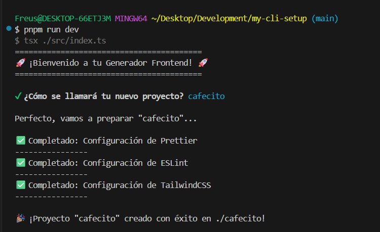

# My-CLI-Setup

My-CLI-Setup es una herramienta de línea de comandos (CLI) diseñada para automatizar y simplificar la creación de entornos de desarrollo para proyectos frontend. Su objetivo principal es generar rápidamente un workspace preconfigurado con tecnologías modernas como React, TypeScript, ESLint y Prettier, abarcando desde la creación de archivos de configuración esenciales hasta la preparación para la instalación de las dependencias necesarias.

## Para Reclutadores Técnicos y Arquitectos de Software

Este proyecto ha sido diseñado siguiendo principios de Clean Architecture y aplicando patrones de diseño fundamentales para asegurar su escalabilidad, mantenibilidad y robustez.

### Patrones de Diseño Implementados:

- **Patrón Command**: El corazón de la gestión de comandos del CLI. Permite desacoplar el objeto que invoca una operación (el `CommandMannager`) del objeto que sabe cómo realizarla (`InitCommand`). Esto facilita la adición de nuevos comandos sin modificar el código existente del invocador, promoviendo el principio Open/Closed.
  - `CommandMannager` (Invocador): Registra y ejecuta los comandos.
  - `Command` (Interfaz): Define el contrato para todos los comandos ejecutables.
  - `InitCommand` (Comando Concreto): Encapsula la lógica específica para inicializar un nuevo proyecto.

- **Patrón Observer**: Utilizado para gestionar el feedback en tiempo real al usuario durante la ejecución de tareas asíncronas, como la creación de archivos. Permite que múltiples "observadores" reaccionen a eventos emitidos por un "sujeto" sin que este último necesite conocer los detalles de los observadores.
  - `TaskRunner` (Sujeto): Emite eventos de `start`, `success` y `error` durante la ejecución de tareas.
  - `TaskObserver` (Interfaz): Define el contrato para los observadores.
  - `CLILogger` (Observador Concreto): Escucha los eventos del `TaskRunner` y actualiza la interfaz de línea de comandos con un spinner y mensajes de estado, mejorando la experiencia del usuario.

- **Patrón Simple Factory**: Centraliza la lógica de creación de objetos complejos (en este caso, la estructura y contenido de los archivos de configuración). Esto permite que el `InitCommand` solicite la creación de configuraciones sin preocuparse por los detalles de cómo se generan esos archivos, facilitando la adición de nuevas configuraciones o la modificación de las existentes en un único lugar.
  - `FileFactory` (Fábrica): Proporciona un método estático (`createConfig`) para generar `FileNode`s (archivos con su contenido) para diferentes tipos de configuración (Prettier, ESLint, TailwindCSS).

### Características Técnicas Adicionales:

- **TypeScript**: Todo el proyecto está desarrollado en TypeScript, garantizando una mayor robustez, detección temprana de errores y una mejor experiencia de desarrollo gracias al tipado estático.
- **Node.js**: Construido sobre la plataforma Node.js, aprovechando su ecosistema para operaciones de sistema de archivos y ejecución de comandos.
- **Módulos ES (ESM)**: Utiliza la sintaxis de módulos ES (`import/export`), alineándose con los estándares modernos de JavaScript.
- **Gestión de Dependencias**: Utiliza `pnpm` para una gestión eficiente de las dependencias.
- **Interactividad CLI**: Implementa `@inquirer/prompts` para una experiencia de usuario interactiva y amigable en la terminal.
- **Feedback Visual**: Incorpora un spinner personalizado para indicar el progreso de las tareas, mejorando la percepción de rendimiento y la usabilidad.
- **Estructura Modular**: El código está organizado en módulos claros y responsabilidades bien definidas, facilitando la comprensión y el mantenimiento.

## Funcionalidades del Proyecto

Actualmente, `My-CLI-Setup` ofrece las siguientes funcionalidades clave:

- **Inicialización de Proyectos (`init` command)**:
  - Pregunta interactivamente por el nombre del nuevo proyecto.
  - Crea una nueva carpeta con el nombre del proyecto en el directorio actual.
  - Genera archivos de configuración esenciales para:
    - **Prettier**: Formateador de código para mantener un estilo consistente.
    - **ESLint**: Linter para identificar y reportar patrones problemáticos en el código.
    - **Tailwind CSS**: Configuración básica para el framework CSS utilitario.
  - Proporciona feedback visual en tiempo real con un spinner durante la creación de archivos.
  - Confirma la creación exitosa del proyecto.

## Instalación y Uso (Para Desarrolladores)

**NOTA**: Esta sección se completará una vez que el proyecto alcance una fase más madura y estable, incluyendo instrucciones detalladas sobre cómo instalar la herramienta globalmente y cómo utilizar sus comandos. Por ahora, el desarrollo se enfoca en la implementación de las funcionalidades principales.

## Imagenes

### Inicio del proyecto

