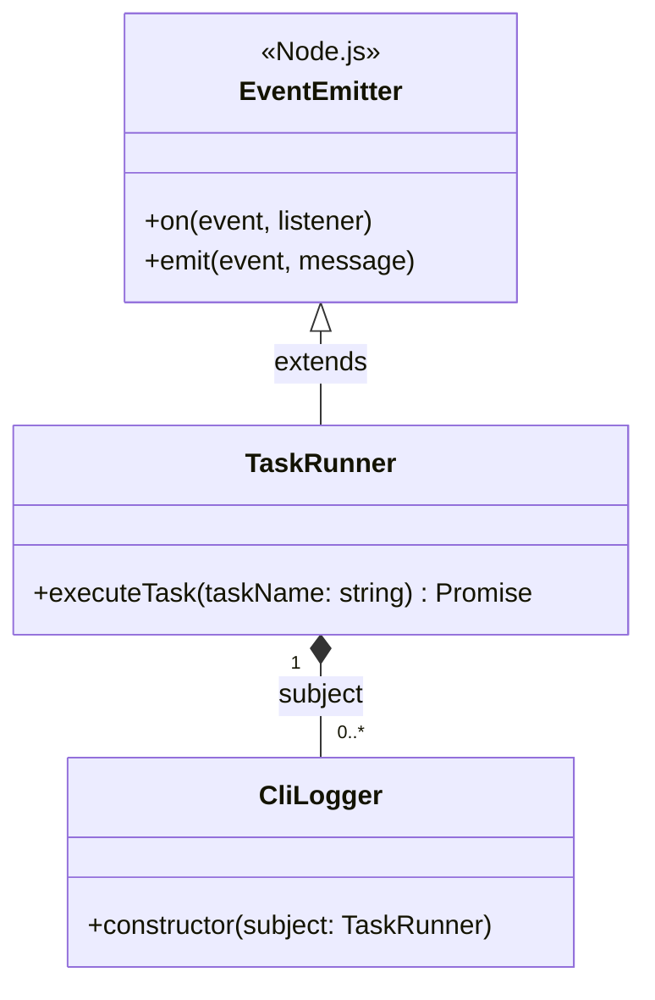
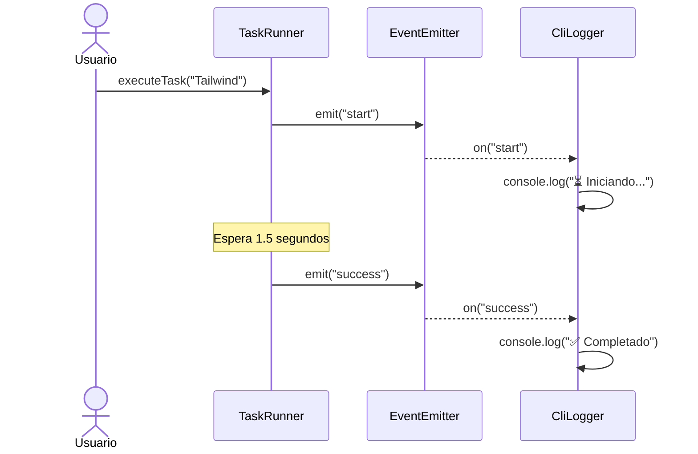
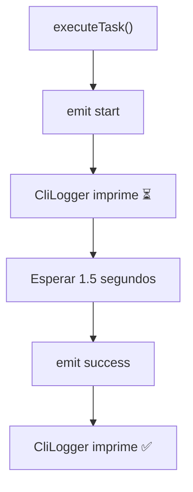
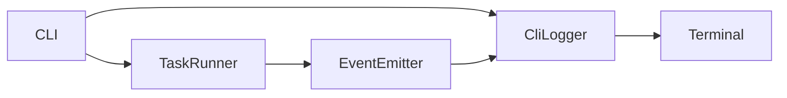

# Aprendizaje

## El Patrón Observer y la Interactividad

**Patrón Observer (Observador)**: Imagina una estación de radio. La estación (el Sujeto) transmite noticias, y muchas radios en las casas (los Observadores) están sintonizadas para escuchar. Las radios no le preguntan a la estación "¿ya hay noticias?" a cada rato; simplemente esperan a que la estación hable y entonces reaccionan.

¿Por qué lo usamos aquí? Porque separar la lógica es vital en Ingeniería de Software. La parte de tu código que crea los archivos (el Sujeto) no debería preocuparse por dibujar textos de colores o animaciones de carga en la terminal. Solo debe "gritar": "¡Empecé a crear Vite!". Y el Observador (nuestro logger/spinner) escuchará eso y se encargará de mostrar el mensaje bonito en pantalla. Esto nos da un código limpio y desacoplado.

### ¿Qué problema resuelve Observer?

Imagina que tienes una estación de radio.

La estación transmite noticias.

Puede haber:

0 radios escuchando.
5 radios escuchando.
1 millón de radios escuchando.

A la estación no le importa.

Ella simplemente transmite.

No necesita saber:

cuántas radios existen?
dónde están?
quién las fabricó?
qué hacen con la información?

Simplemente dice:

"Acabo de transmitir una noticia."

Eso es exactamente Observer.

### Código

```typescript
/**
 * Implementación del Patrón Observer para manejar el feedback del CLI.
 * Utilizamos EventEmitter de Node.js, que es la forma nativa de aplicar este patrón.
 */
import { EventEmitter } from 'node:events'

// 1. Defines estrictamente qué eventos existen y qué parámetros reciben
interface TaskEvents {
  start: [message: string]
  success: [message: string]
}

/**
 * EL SUJETO (Subject).
 * Es el encargado de realizar el trabajo pesado (como crear archivos)
 * y emitir eventos cuando algo importante sucede.
 */
export class TaskRunner extends EventEmitter<TaskEvents> {
  /**
   * Simula la ejecución de una tarea.
   * @param taskName - El nombre de la tarea a ejecutar (ej. "Configurando Tailwind")
   */
  public async executeTask(taskName: string): Promise<void> {
    // 1. Emitimos el evento de que hemos comenzado
    this.emit('start', `Iniciando: ${taskName}...`)

    // Simulamos un retraso (como si estuviera descargando o creando archivos)
    // En el futuro, aquí irá el código real de creación de archivos.
    return new Promise((resolve) => {
      setTimeout(() => {
        // 2. Emitimos el evento de éxito
        this.emit('success', `Completado: ${taskName} configurado correctamente.`)
        resolve()
      }, 1500)
    })
  }
}

/**
 * EL OBSERVADOR (Observer).
 * Su única responsabilidad es escuchar al Sujeto y mostrar los mensajes en la terminal.
 * No sabe nada de crear archivos, solo sabe cómo mostrar texto.
 */
export class CLILogger {
  /**
   * @param subject - El TaskRunner al que nos vamos a suscribir
   */
  constructor(subject: TaskRunner) {
    // Nos suscribimos al evento 'start'
    subject.on('start', (message) => {
      console.log(`⏳ ${message}`)
    })

    // Nos suscribimos al evento 'success'
    subject.on('success', (message) => {
      console.log(`✅ ${message}`)
      console.log('----------------')
    })
  }
}


//index.ts
#!/usr/bin/env node

/**
 * Punto de entrada principal de nuestro CLI.
 */
import { input } from '@inquirer/prompts'
import { TaskRunner, CLILogger } from './patterns/Observer.js'

async function main() {
  console.log('=========================================')
  console.log('🚀 ¡Bienvenido a tu Generador Frontend! 🚀')
  console.log('=========================================\n')

  // 1. Fase de Interactividad: Hacemos una pregunta al usuario
  // Esto pausa la ejecución hasta que el usuario responda y presione Enter.
  const projectName = await input({
    message: '¿Cómo se llamará tu nuevo proyecto?',
    default: 'mi-app-genial'
  })

  console.log(`\nPerfecto, vamos a preparar "${projectName}"...\n`)

  // 2. Implementación del Patrón Observer
  const runner = new TaskRunner() // Creamos el Sujeto
  new CLILogger(runner) // Creamos el Observador y lo conectamos al Sujeto

  // 3. Ejecutamos las tareas.
  // Nota cómo aquí solo llamamos a la lógica, no escribimos console.log().
  // El Observer se encarga de mostrar los mensajes.
  await runner.executeTask('Estructura base de React + Vite')
  await runner.executeTask('Configuración de TypeScript')
  await runner.executeTask('Archivos de Prettier y ESLint')
  await runner.executeTask('Configuración de TailwindCSS')

  console.log(`\n🎉 ¡Proyecto "${projectName}" creado con éxito!`)
}

// Como ahora usamos await, la función principal debe ser manejada
main().catch((error) => {
  console.error('Hubo un error crítico:', error)
  process.exit(1)
})

```

### Diagrama de clases

Este responde:

¿Quién es quién dentro del patrón?



No existe una llamada directa como:

```txt
TaskRunner ---> console.log()
```

Eso sería acoplamiento.

En cambio ocurre:

```txt
TaskRunner ---> emit() ---> EventEmitter ---> CliLogger ---> console.log()
```


### Diagrama de secuencia (el más importante)

Este responde:

¿Qué ocurre cuando llamo executeTask()?




### Diagrama de flujo

Este responde: ¿Cuál es el flujo lógico del programa?




### Diagrama de arquitectura (dependencias)

Este responde: ¿Quién conoce a quién?



Aquí ves el desacoplamiento.

Sin Observer sería:

```txt
CLI
 │
 ▼
TaskRunner
 │
 ▼
Terminal
```


Con Observer:

```txt
CLI
 │
 ├─────────────┐
 ▼             ▼
TaskRunner   CliLogger
      │
      ▼
EventEmitter
      │
      ▼
CliLogger
```
