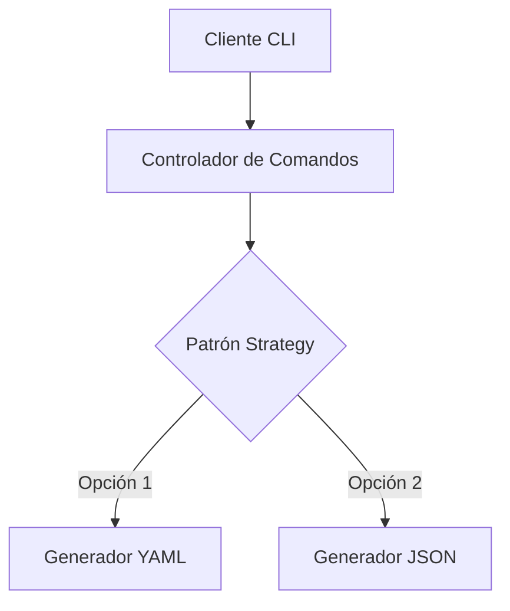

# Aprendizaje

```mermaid
graph TD;
    A[Cliente CLI] --> B[Controlador de Comandos];
    B --> C{Patrón Strategy};
    C -->|Opción 1| D[Generador YAML];
    C -->|Opción 2| E[Generador JSON];
```

algo
